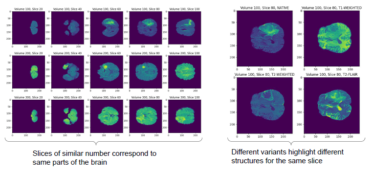
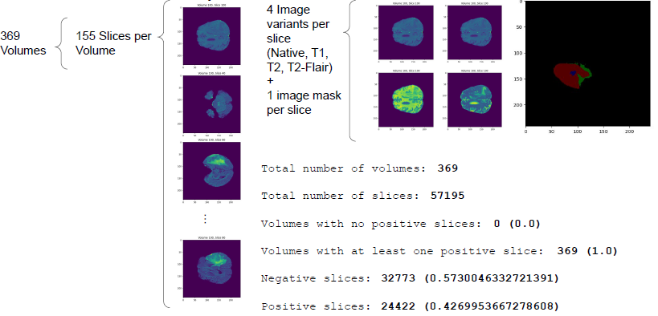
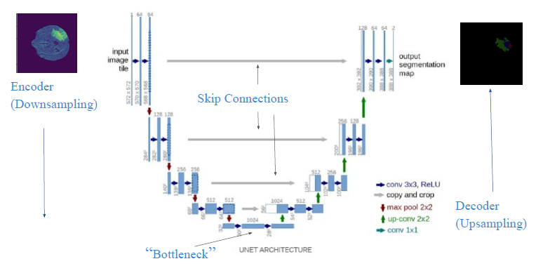

# Brain Tumor Segmentation using U-Net
This project aims to perform image segmentation of brain MRI images to classify each pixel as part of different parts of a tumor using the U-Net architecture. The dataset used is the BraTS 2020 dataset.

## Introduction
This project involves training a U-Net model to segment brain tumors from MRI images. The task includes classifying each pixel in an MRI slice into one of four labels: Normal, Necrotic and Non-Enhancing Tumor Core, Peritumoral Edema, and GD-enhancing tumor.

## Dataset
The dataset consists of 57,195 image slices from 369 volumes, each with a resolution of 240x240 pixels and 4 channels (T1, T1Gd, T2, and T2-FLAIR). Each slice is accompanied by an expert segmentation mask.

### Sample Images



### Dataset Description


## Methodology
The U-Net architecture used in this project comprises an encoder, a decoder, and skip connections. The encoder extracts features, the decoder reconstructs a high-resolution output, and the skip connections combine low-level and high-level features.

Two models were trained:

1) A pre-trained encoder (MobileNetV2) model.
2) A model trained from scratch.
Both models were trained using a GTX 1660 Super graphics card with CUDA, with a batch size of 20 and the Adam optimizer.

## Model Description


### Pre-trained Encoder Model
Encoder: MobileNetV2 (trainable = false) <br>
Input resolution: 224x224 pixels <br>
Downsampling and upsampling blocks: 4 each <br>

### Trained from Scratch Model
Input resolution: 240x240 pixels <br>
Downsampling and upsampling blocks: 4 each <br>

## Data Preprocessing
### Data Splitting
The dataset was split based on volumes to prevent data leakage, using sklearn's GroupShuffleSplit.

### Imbalance
The dataset is highly imbalanced, with the 'normal' class being the most abundant. Class weights were applied to balance the relevance of each class.

### Image Rescaling
For the pre-trained model, images were rescaled to 224x224 pixels using TensorFlow's resize function.

## Results

| Metric                       | Pre-trained Encoder Model | Trained from Scratch Model |
|------------------------------|---------------------------|----------------------------|
| **Loss**                     |                           |                            |
| Training Loss                | 0.000404                  | 0.000450                   |
| Validation Loss              | 0.006585                  | 0.004343                   |
| **Accuracy**                 |                           |                            |
| Training Accuracy            | 0.987424                  | 0.992478                   |
| Validation Accuracy          | 0.992478                  | 0.987424                   |
|**Sparse Categorical Accuracy**| 0.760608              | 0.820632                      |
||

## Conclusion
The trained-from-scratch model showed superior performance over the pre-trained encoder, with better loss metrics, accuracy, and sparse categorical accuracy. This indicates better generalization on unseen data and better handling of class imbalances.

## References
-  [TensorFlow U-Net Example](https://www.bing.com/search?q=tensorflow+unet+example)
- [C. Versloot, “How to Build a U-Net for Image Segmentation with TensorFlow and Keras,” 2023.](https://github.com/christianversloot/machine-learning-articles/blob/main/how-to-build-a-u-net-for-image-segmentation-with-tensorflow-and-keras.md).
- [BraTs2020 Dataset]([https://www.kaggle.com/datasets/awsaf49/brats2020-training-data/data).
- B. H. Menze et al., “The Multimodal Brain Tumor Image Segmentation Benchmark(BRATS),” in IEEE Transactions on Medical Imaging, vol.34, no. 10, pp. 1993-2024, 2015. DOI: 10.1109/TMI.2014.2377694.
- S. Bakas et al., “Advancing The Cancer Genome Atlas glioma MRI collections withexpert segmentation labels and radiomic features,” in Nature Scientific Data, vol. 4, article 170117, 2017. DOI: 10.1038/sdata.2017.117.
- S. Bakas et al., “Identifying the Best Machine Learning Algorithms for Brain Tumor Segmentation, Progression Assessment, and Overall Survival

## Organization of the Directory
```
|   .gitignore
|   data_exploration.ipynb
|   hdf5_files_analysis.ipynb
|   LICENSE
|   README.md
|   requirements.txt
|   u-net.ipynb
|   
+---images
|       description.png
|       sample.png
|       unet.png
|       
\---reports
        data_analysis.pdf
        report.pdf
```
        
